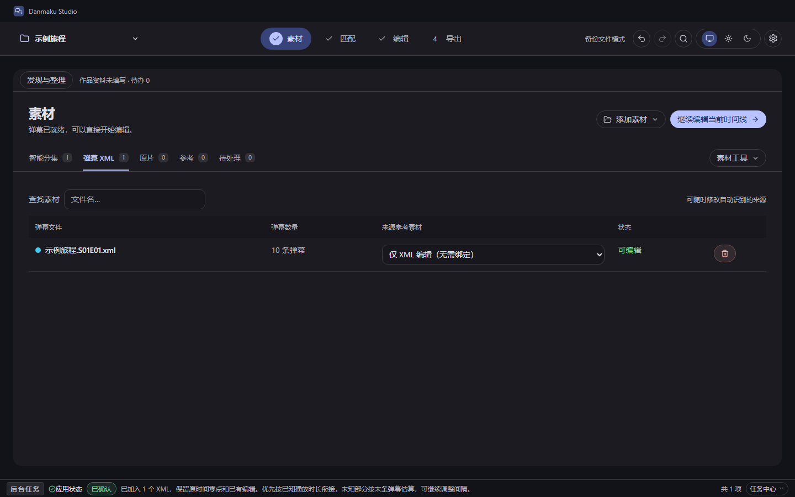
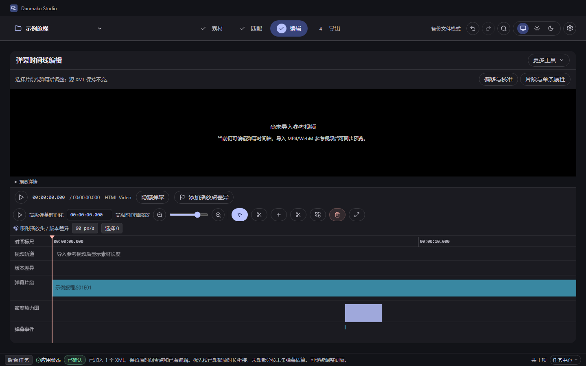
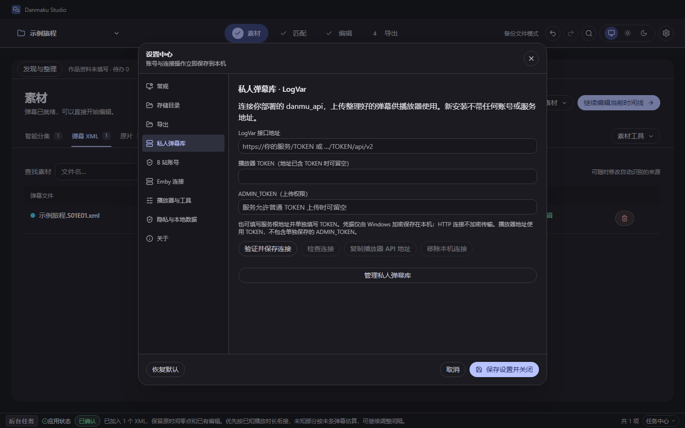

# Danmaku Studio

**简体中文** · [English](README.en.md)

把不同视频版本的弹幕，带回你真正想看的原片。

Danmaku Studio 是一个本地运行的 Windows 弹幕匹配与编辑工具。它面向有分 P、删减、填充和时间偏移的参考素材：导入弹幕 XML 和媒体，自动生成时间关系，检查疑点，再导出适合原片的弹幕。也可以只编辑 XML，无需视频。

[下载安装](https://github.com/ninxio/DanmakuStudio/releases/latest) · [使用指南](docs/USER_GUIDE.md) · [LogVar 接入](docs/LOGVAR.md) · [更新历史](CHANGELOG.md)

## 界面预览

素材管理、弹幕编辑与服务连接。



<details>
<summary>查看弹幕编辑与 LogVar 设置</summary>





</details>

## 能做什么

- **音频匹配**：根据两侧音轨建立时间关系；保留 CPU 和可选 CUDA 声谱计算。
- **AAP 画面匹配（实验性）**：尝试通过画面感知哈希生成分段映射。尚未经过实际使用验证，保留为后续 fork 改进的参考实现。
- **逐段检查**：共同内容、版本差异和不确定区域分别表达，支持预览、边界调整与手动校准。
- **编辑和导出**：保留原始时间，支持多份 XML、分 P、撤销、保存恢复与 XML/ASS 导出。
- **可选素材接入**：获取 B 站弹幕和参考音频，或通过 Emby、WebDAV、Motrix 接入素材。
- **可选私人弹幕库**：连接自己部署的 [LogVar / danmu_api](https://github.com/huangxd-/danmu_api)，上传整理好的弹幕，在兼容播放器中使用。主流程无需自建 API。

编辑不覆盖原始 XML 和视频。匹配在本机运行，不依赖云端模型。

## 工作原理

Studio 比较参考素材与目标视频的声音或画面，找到共同片段，再建立分段时间映射。音频匹配寻找相同的声音内容；AAP 使用画面感知哈希寻找连续对应的镜头。

弹幕按映射换算到目标视频的时间线上，因此可以分别处理片头偏移、中途删减和插入片段。重复镜头、未匹配区域和不确定边界需要检查或手动校准。[算法与限制](docs/ALGORITHMS.md)

## 三种开始方式

| 已有素材 | 操作 |
| --- | --- |
| 只有 XML | 素材 → 导入 XML → 编辑 → 导出 |
| 参考音频/视频、原片和 XML | 素材 → 匹配 → 音频匹配 → 检查 → 导出 |
| 两侧视频画面相同，但音轨不同 | 可尝试实验性 AAP → 逐段检查和校准 → 导出 |

### 一次完整操作

1. **准备素材**：XML 是你想迁移的弹幕；参考媒体是它原本对应的版本；原片是你最终要观看的版本。
2. **导入并配对**：在素材页加入文件，把 XML 绑定到正确的参考素材。分 P 文件逐一确认归属。
3. **选择匹配方式**：声音接近时用音频匹配；画面接近、配音不同或无音轨时，可尝试实验性 AAP。开始后可以停止。
4. **检查和修整**：进入编辑页，检查开头、中间删改点和结尾，处理重复镜头与未匹配区间。必要时手动调整边界和偏移。
5. **导出并试播**：确认导出范围，保存 XML 或 ASS，再用原片实际播放检查。项目另行保存，便于继续编辑。
6. **可选上传**：若要从播放器调用私人库，连接 LogVar，核对片名、年份和季集，预览新增/替换清单，再上传并回读核验。[详细步骤](docs/LOGVAR.md)

AAP 需要两侧视频；仅有参考音频时请选择音频匹配。目前 AAP 只做过自动化与合成样本检查，没有经过实际使用测试，不保证真实影片的匹配效果。欢迎后续 fork 在此基础上验证和改进。

## 下载与运行环境

Windows x64：[下载安装包](https://github.com/ninxio/DanmakuStudio/releases)。

- 纯 XML 编辑不需要外部媒体工具。
- 自动匹配需要 FFmpeg 和 FFprobe，在“设置 → 播放器与工具”检测或指定路径。
- MKV/HEVC 等格式的应用内预览需要兼容的 x64 libmpv DLL。
- 安装包不包含 FFmpeg、libmpv 或原片；Windows 需要 WebView2 运行时。请使用你有权处理的素材。

私人弹幕库需结合 [LogVar / danmu_api](https://github.com/huangxd-/danmu_api) 使用；地址格式和上传权限见 [接入指南](docs/LOGVAR.md)。本地编辑、匹配和导出无需部署 API。

[使用指南](docs/USER_GUIDE.md) · [本地数据与隐私](docs/PRIVACY.md)

## 迭代概览

以下是按能力整理的概述，不是每个补丁版本的逐项发布记录。

| 阶段 | 主要变化 |
| --- | --- |
| 早期 / 0.1 系列 | 从 XML 解析、时间偏移与 ASS 导出，逐步加入音频对齐、时间线编辑和桌面应用。 |
| 0.2 系列 | 整理为素材 → 匹配 → 编辑 → 导出的工作台；完善恢复、分集、私人库与本地存储。 |
| 0.3 | 完善影视资料、季集目录及素材接入流程。 |
| 0.4 | 尝试加入 AAP 画面匹配，保留实验性实现供后续探索。 |
| 0.4.1 | 私人库默认接入 LogVar；加入上传预览、限制检查与回读验证，补充双语文档。 |

详见 [更新历史](CHANGELOG.md)。

## 从源码运行

使用 Node.js 20、pnpm 9、Rust stable，以及 Tauri 2 所需的 Windows C++ 构建工具和 WebView2。

```powershell
corepack pnpm install --frozen-lockfile
corepack pnpm tauri:dev
```

网页开发预览使用 `corepack pnpm dev`；本地文件识别、持久化、媒体匹配和 LogVar 接入需要桌面后端。[构建与验证](docs/BUILDING.md)包含完整命令。

## 特别感谢

- [DanDanPlayForAndroid](https://github.com/xyoye/DanDanPlayForAndroid)：为本地视频搭配弹幕的使用流程提供了早期参考。
- [DanmakuPlayer](https://github.com/Poker-sang/DanmakuPlayer)：为弹幕预览与播放同步提供了产品参考。
- [danmubox-develop](https://github.com/danmubox/danmubox-develop)：为弹幕导入、管理与导出的功能设计提供了早期参考。
- [Bilibili-Evolved](https://github.com/the1812/Bilibili-Evolved)：其公开实现为弹幕处理、分 P 时长与素材获取流程的研究提供了参考。
- [弹弹play开放平台文档](https://doc.dandanplay.com/open/)：为播放器弹幕接口兼容性研究提供了参考。
- [bili-danmaku-mapper](https://github.com/dowdah/bili-danmaku-mapper)：提供了 AAP 画面感知哈希匹配的思路。Studio 仅做了尝试性实现，尚未经过实际使用测试，留作后续 fork 的探索方向。
- [LogVar / danmu_api](https://github.com/huangxd-/danmu_api)：提供弹幕聚合、播放器接口与本地弹幕库，成为 Studio 整理结果的可选使用端。
- [FFmpeg](https://ffmpeg.org/) 与 [mpv](https://mpv.io/)：为本地媒体解析、采样、音轨处理和预览提供基础能力，运行组件需用户另行安装。
- [Tauri](https://tauri.app/)、[React](https://react.dev/)、[Lucide](https://lucide.dev/) 与 [Material Color Utilities](https://github.com/material-foundation/material-color-utilities)：支持桌面外壳、界面、图标及主题配色。

## 反馈与贡献

欢迎提供不含私人信息的复现步骤、合成样本和错误时间点。请说明参考与原片分别发生了什么变化，以及错误区间；不要上传账号、授权播放地址或无权分享的影片。项目文件会包含媒体路径，分享前请检查。

项目仍处于早期开发阶段。由于此类需求确实比较小众，现阶段已满足个人使用需要，后续大概率不会再有版本更新。

## 使用与权利说明

本项目源于个人学习与兴趣，源码依开源许可证发布，与所涉及的第三方平台无隶属或官方合作关系。使用第三方内容和服务时，请遵守适用法律及平台规则，并取得所需授权。

如权利人认为本仓库的代码、文档或示例侵害其合法权益，请通过 [Issue](https://github.com/ninxio/DanmakuStudio/issues) 联系维护者，说明涉及内容和权利依据。维护者会及时核查，并对确有问题的内容采取删除、下架或其他必要处理。请勿在公开反馈中附上证件、账号凭据等敏感信息。

源码采用 [GPL-3.0-only](LICENSE)。第三方依赖与许可见 [THIRD_PARTY_NOTICES.md](THIRD_PARTY_NOTICES.md)。
