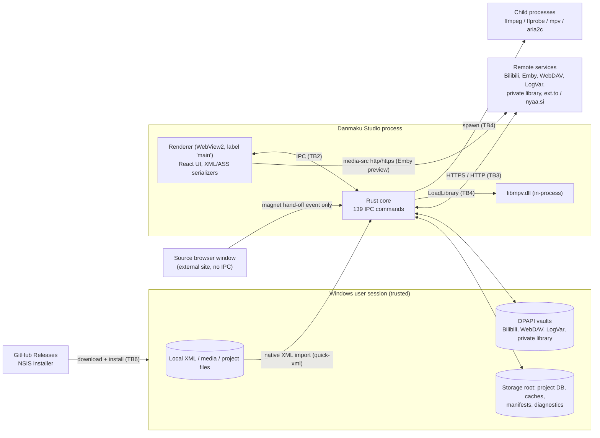

# Threat Model

Danmaku Studio (Danmaku Timeline Studio) 0.4.1, Windows x64 desktop build.

| | |
|---|---|
| Baseline | `main` at `86cc02b` (application version 0.4.1) |
| Reviewed | 2026-10 |
| Method | Manual source review of `src/` and `src-tauri/`, STRIDE per trust boundary, hostile-input unit tests |
| Out of scope | The internals of FFmpeg, mpv/libmpv, libass, WebView2 and remote services; the Python `ml/` research scripts; the alignment algorithms' correctness |

**How to read this document.** Statements marked **Verified** were confirmed by reading the code at the cited `path:line`, or by a test in this repository. Statements marked **Assumption** describe platform or third-party behaviour that this review did not confirm. Line numbers refer to the baseline commit and will drift as the code changes.

Residual risk is rated **Low / Medium / High** from likelihood and impact under the stated trust model (section 3). It is not a CVSS score.

---

## 1. System overview

Studio is a Tauri 2 application. The parts relevant to security are:

- **Renderer (React/TypeScript, `src/`).** Runs in a WebView2 window labelled `main`. It holds the editable project state, renders danmaku text with React (no raw-HTML sinks: no `dangerouslySetInnerHTML`, `innerHTML`, `eval` or `new Function` in `src/`), and serializes XML and ASS on export or preview.
- **Native core (Rust, `src-tauri/src/`).** Exposes 139 IPC commands through one `generate_handler!` list (`src-tauri/src/lib.rs:70-209`). It performs all file-system, network, process and credential work.
- **External tools.** FFmpeg/FFprobe and an optional mpv executable are started as child processes. libmpv is loaded in-process as a DLL. Motrix's bundled `aria2c` is spawned for torrent metadata.
- **Remote services, all optional.** Bilibili (fixed hosts), Emby, WebDAV, LogVar and a self-hosted "private library" (all user-configured URLs), Motrix RPC on loopback, and the `ext.to` / `nyaa.si` source pages. There is no direct TMDB client: TMDB lookups go through the user's private-library server (`src-tauri/src/private_library/catalog.rs:13-38`).
- **Local data.** Project database and caches under the configurable storage root, credential vaults under `app_local_data_dir`, settings under `app_config_dir` and renderer `localStorage`.

### 1.1 Data flow

---

## 2. Assets

| Asset | Where it lives | Why it matters |
|---|---|---|
| A1 Service credentials: Bilibili cookies + refresh token, WebDAV Basic password, LogVar read/admin tokens, private-library publish/read tokens | DPAPI files under `app_local_data_dir` (section 5) | Account takeover, unauthorized publishing |
| A2 Emby password and access token | Renderer memory only (`src/infrastructure/settings/volatileEmbyCredentials.ts:3-50`) | Media-server account access |
| A3 User media and danmaku content, project database | Storage root | Privacy, user's work |
| A4 Local file paths and library layout | Projects, `alignment-run-manifests` | Privacy (paths reveal names and folder structure) |
| A5 Integrity of exported XML | User-chosen export directory | Corrupted or injected output shared with others |
| A6 Integrity of the code that runs | Installer, `ffmpeg`/`mpv` executables, `libmpv` DLL | Code execution as the user |
| A7 Availability of the editor | Renderer and Rust core | Large or hostile input freezing or crashing the app |

---

## 3. Trust boundaries and assumptions

| ID | Boundary | Untrusted side |
|---|---|---|
| TB1 | Imported files → parsers | XML, project files and media from the internet or other people |
| TB2 | Renderer → Rust IPC | Renderer is treated as **less trusted** than the Rust core, because any script running there can call every command |
| TB3 | Rust core ↔ remote services | Network attackers and the services' responses |
| TB4 | Rust core → external executables / DLLs | Paths supplied over IPC or found on search paths |
| TB5 | Studio ↔ other processes of the same user | Explicitly **trusted** by `SECURITY.md` ("Local account access is trusted") |
| TB6 | Release pipeline → user's machine | The download channel |

Working assumptions:

- **Assumption:** WebView2 sandboxing and patching are handled by the Evergreen runtime.
- **Assumption:** the user picks remote server URLs deliberately, so a malicious *configured* server is lower likelihood than a malicious *file*.
- **Verified:** IPC is restricted to the `main` webview. The invoke wrapper rejects any other label (`src-tauri/src/lib.rs:210-215`), so the external source-browser window cannot call commands. The capability file also grants permissions to `main` only (`src-tauri/capabilities/default.json:5`).

---

## 4. Existing security controls (verified)

These controls already exist. The findings in section 6 should be read against them.

**Native XML import** (`src-tauri/src/xml_import_receipt.rs`)
- DTD/DOCTYPE is rejected (`:452-453`). A Rust test covers this (`:1329-1333`).
- Only the five predefined entities and valid character references are decoded. Any other entity is an error (`:749-768`).
- Characters not allowed in XML 1.0 are rejected (`:718-729`).
- Size and count limits (`:36-47`):
  - 64 MiB per file, 256 MiB per batch, 256 files per batch.
  - 250,000 items per file, 500,000 per batch.
  - 1 MiB per comment, 16 KiB and 64 fields per `p` attribute.
  - Nesting depth 256, 50,000 warnings.
- Paths must be absolute, end in `.xml` and contain no `://` (`:200-225`).
- Files are read through a pinned handle, and each import produces an HMAC-signed content receipt (`:143-190`, `:999-1050`).

**Renderer XML metadata**
- The metadata fragment that native import returns is rejected when it contains `<!DOCTYPE` or exceeds 1 MiB (`src/infrastructure/xml/xmlMediaMetadata.ts:96-107`).
- The renderer re-validates the native response shape, ordering and file names (`src/infrastructure/xml/nativeXmlReceipt.ts:110-184`).

**Output escaping**
- XML export escapes `& < >` in text, and also `" '` in attributes (`src/infrastructure/xml/bilibiliXml.ts:236-242`).
- Exports are re-parsed before they are written (`validateExportedXml`, `bilibiliXml.ts:162-180`).
- In the ASS preview track, `\ { }` are replaced with full-width look-alikes and CR/LF become spaces. This keeps danmaku text from injecting override tags or new lines (`src/domain/preview/danmakuTrack.ts:109-114`).
- The ASS payload is capped at 8 MiB (`danmakuTrack.ts:116-118`). The native side also checks it for NUL and size (`src-tauri/src/libmpv_subtitles.rs:70-83`).

**Renderer hardening**
- CSP sets `script-src 'self'` and `connect-src ipc: http://ipc.localhost` (`src-tauri/tauri.conf.json:25`).
- The only plugin is `dialog`, granted `allow-open` only. There is no fs, shell or opener plugin (`src-tauri/capabilities/default.json:6-16`, `src-tauri/src/lib.rs:58`).
- The asset protocol is not compiled in, because Tauri is built with `features = []` (`src-tauri/Cargo.toml:18`).

**Credential storage**
- All persistent secrets are encrypted with Windows DPAPI, user scope (`src-tauri/src/credential_protection.rs:18-40`).
- The renderer receives only non-secret status objects. Examples: WebDAV `{id, name, root}` (`src-tauri/src/webdav/connection.rs:14-29`) and LogVar `{configured, serviceUrl, hasAdminToken}` (`src-tauri/src/logvar.rs:66-72`).

**TLS and network**
- `reqwest` uses rustls with bundled webpki roots (`src-tauri/Cargo.toml:21`). No code disables certificate verification.
- Every client limits response sizes.
- Redirects are disabled or re-validated hop by hop:
  - Emby follows same-origin redirects only (`src-tauri/src/emby_transport.rs:4-19`).
  - WebDAV refuses https→http downgrades and checks off-origin hops for SSRF, then pins their DNS (`src-tauri/src/webdav/transport.rs:121-213`).
- Bilibili endpoints are hard-coded HTTPS. Cookies are attached only to `https://*.bilibili.com` (`src-tauri/src/bilibili/auth/credential.rs:82-102`). The media CDN allowlist requires HTTPS on port 443 (`src-tauri/src/bilibili/api.rs:151-172`).
- The private library requires HTTPS, except to loopback (`src-tauri/src/private_library/mod.rs:157-162`).

**Process execution**
- The main spawner uses `CreateProcessW` with an argument vector and no shell. Children start suspended with `CREATE_NO_WINDOW`, inside a kill-on-close Job Object (`src-tauri/src/process_supervision.rs:1482-1573`).
- The alignment pipeline pins FFmpeg/FFprobe: absolute PATH entries only, PE header check, SHA-256 hash, launched by Volume-GUID path (`src-tauri/src/media_toolchain.rs:107-371`). Media is passed as `-i <\\?\Volume{GUID}\…>`.
- There is no `cmd.exe` or PowerShell in production code.

**Logging**
- Alignment diagnostics are typed JSONL tagged `path-free-content-free-v1` (`src-tauri/src/diagnostic_log.rs:100-107`).
- Several Rust tests assert that tool errors never echo local paths or Emby tokens. Examples: `media_tools::tests::mpv_status_and_errors_redact_emby_tokens` and `audio_alignment::tests::invalid_local_media_path_is_never_echoed_to_errors_or_job_logs`.

---

## 5. Credential storage summary

| Secret | Storage | Transport | Notes |
|---|---|---|---|
| Bilibili cookies + refresh token | DPAPI `app_local_data_dir/bilibili/credential.dpapi` (`src-tauri/src/bilibili/auth/credential.rs:113-145`) | HTTPS only, `*.bilibili.com` only | Cookie header marked sensitive (`src-tauri/src/bilibili/api.rs:123`). Logout deletes the local file but does not revoke the session server-side (`src-tauri/src/bilibili/auth/mod.rs:333-343`). |
| WebDAV username/password | DPAPI `app_local_data_dir/webdav-v1/connections.dpapi` (`src-tauri/src/webdav.rs:58-64`) | **HTTP or HTTPS** (`src-tauri/src/webdav/connection.rs:74`) | Basic auth is sent to the configured origin only (`src-tauri/src/webdav/transport.rs:35-50`). |
| LogVar read/admin token | DPAPI `logvar-library/connection.dpapi` (`src-tauri/src/logvar.rs:42-62`) | **HTTP or HTTPS, any host** (`src-tauri/src/logvar.rs:94`) | The token is a **URL path segment** (`src-tauri/src/logvar.rs:167-182`). The player URL with its token is returned to the renderer and copied to the clipboard (`src-tauri/src/logvar.rs:293-296`). |
| Private-library tokens | DPAPI `private-library/connection.dpapi` (`src-tauri/src/private_library/mod.rs:139-146`) | HTTPS (loopback HTTP allowed) | The read token is a URL path segment, by design of the player URL. |
| Emby password / token | Renderer memory only | **HTTP or HTTPS** (`src-tauri/src/lib.rs:298-304`, `src-tauri/src/emby_audio.rs:766-770`) | Preview puts the token in an `api_key` query parameter (`src/infrastructure/metadata/embyClient.ts:207`). |
| Motrix RPC token | Read from Motrix's own `%APPDATA%\Motrix\bridge\endpoint.json`; never stored by Studio (`src-tauri/src/motrix.rs:65-97`) | `http://127.0.0.1` | |

DPAPI is called without optional entropy and without `CRYPTPROTECT_LOCAL_MACHINE` (`src-tauri/src/credential_protection.rs:18-40`). Any process running as the same Windows user can decrypt the vaults. That matches the trust model in `SECURITY.md`; DPAPI protects against offline disk access by other accounts, not against same-user malware.

---

## 6. STRIDE analysis

### 6.1 Summary

| ID | STRIDE | Threat | Residual |
|---|---|---|---|
| T1 | E | Renderer compromise → arbitrary executable/DLL via IPC-supplied tool paths | **Medium** |
| T2 | I / T | Credentials sent over cleartext HTTP (LogVar, WebDAV, Emby) | **Medium** |
| T3 | T / S | Unsigned installer, no publisher-signed checksums, no update channel | **Medium** |
| T4 | I | LogVar / Emby tokens in URLs (path, query, argv, clipboard) | Low–Medium |
| T5 | E | libmpv DLL search order includes user-writable folders and `PATH` | Low |
| T6 | I / S | Generic `emby_http_request` proxy to any http(s) URL | Low |
| T7 | D / I | Hostile XML import (XXE, entity expansion, size, depth) | Low |
| T8 | T | Injection through exported XML / ASS | Low |
| T9 | I | UNC paths accepted by some commands (NTLM credential leak) | Low |
| T10 | E | Bare tool names resolved with current directory first | Low |
| T11 | T | `ffprobe` probe passes the media path positionally (no `-i`, no protocol whitelist) | Low |
| T12 | E / I | mpv sidecar loads user config/scripts; libmpv allows remote URLs | Low |
| T13 | S / T | Source-browser hand-off nonce visible to site scripts | Low |
| T14 | I | Sensitive manifests and settings stored in plaintext | Low |
| T15 | I | Same-user process reads DPAPI vaults | Low (accepted) |
| T16 | T | Third-party dependency vulnerabilities | Low–Medium |
| T17 | R | Limited audit trail of remote actions (publishing, uploads) | Low |
| T18 | I | CSP broader than needed (`media-src http: https:`, stale `asset:`, inline styles) | Low |

### 6.2 Details

#### T1. Renderer compromise escalates to native code execution (Elevation of privilege). Residual: **Medium**

- **Entry point (verified).** Several IPC commands take an executable or DLL path from the renderer and run or load it with no allowlist or signature check:
  - `detect_media_tool` runs any path with `-version` (`src-tauri/src/media_tool_detection.rs:80-88`).
  - `start_mpv_sidecar` runs `Command::new(request.mpv_path)` (`src-tauri/src/mpv_sidecar.rs:30-43`).
  - The ffprobe path for `probe_media_timeline` (`src-tauri/src/media_probe.rs:750`).
  - The ffmpeg paths in Emby audio (`src-tauri/src/emby_audio.rs:414-439`) and WebDAV media (`src-tauri/src/webdav/media.rs:164`).
  - The libmpv commands, which accept any absolute `*.dll` path (`src-tauri/src/libmpv_runtime.rs:8-19`).
- **Existing mitigation (verified).**
  - CSP `script-src 'self'` (`src-tauri/tauri.conf.json:25`).
  - No raw-HTML sinks in `src/`. Remote HTML from source pages is parsed with an inert `DOMParser` and never mounted (`src/infrastructure/acquisition/sourceProviders.ts`).
  - IPC is limited to the `main` window (`src-tauri/src/lib.rs:210-215`).
  - The alignment pipeline's pinned toolchain (`src-tauri/src/media_toolchain.rs`) does check PE headers, but the commands above bypass it.
- **Residual risk.** Impact is High: code execution as the user. Likelihood is Low, because it first needs script execution inside the renderer and no such vector was found. Combined: Medium. This is a defence-in-depth gap: today the renderer is effectively as trusted as the Rust core.
- **Recommendation.**
  - Store tool paths on the Rust side: set them only through a native file dialog, and persist them in Rust-owned settings.
  - Have IPC commands take a tool *kind* rather than a path.
  - Route every FFmpeg/FFprobe launch through `PinnedMediaToolchain`.
  - For libmpv and mpv, require the same PE and architecture checks, and consider an Authenticode or hash allowlist.

#### T2. Credentials over cleartext HTTP (Information disclosure, Tampering). Residual: **Medium**

- **Entry point (verified).**
  - LogVar accepts `http://` for any host (`src-tauri/src/logvar.rs:94`) and puts the token in the URL path (`:167-182`).
  - WebDAV accepts `http://` roots with Basic authentication (`src-tauri/src/webdav/connection.rs:74`).
  - Emby login (`src/infrastructure/metadata/embyClient.ts:161-171`) and audio download (`src-tauri/src/emby_audio.rs:766-770`) accept `http://`.
- **Existing mitigation (verified).**
  - WebDAV never follows a redirect from https to http (`src-tauri/src/webdav/transport.rs:182-184`).
  - Emby redirects stay same-origin, and origin includes the scheme (`src-tauri/src/emby_transport.rs:4-19`).
  - The private library already enforces HTTPS except on loopback (`src-tauri/src/private_library/mod.rs:157-162`), so the pattern exists in the codebase.
- **Residual risk.** Medium. Home NAS and Emby servers on a LAN are commonly plain HTTP. Anyone on the path (shared Wi-Fi, a compromised router) can capture reusable credentials.
  - **Assumption:** rustls validates against bundled webpki roots rather than the Windows store, so self-signed or private-CA servers fail TLS, which may push users to `http://`.
- **Recommendation.**
  - Apply the private-library rule to LogVar, WebDAV and Emby: HTTPS required, with HTTP allowed only for loopback, or behind an explicit "insecure LAN" opt-in with a visible warning.
  - Consider `rustls-platform-verifier`, so certificates the user installed in Windows are honoured.

#### T3. Distribution integrity (Tampering, Spoofing). Residual: **Medium**

- **Entry point (verified).**
  - The release script only adds path-remapping flags and runs `tauri build` (`scripts/build-desktop-release.mjs:1-26`).
  - There is no `signtool` step and no `bundle.windows` certificate configuration in `src-tauri/tauri.conf.json`.
  - There is no updater plugin.
  - Release notes give no hash (`RELEASE_NOTES.md`).
  - `PUBLIC_SOURCE_MANIFEST.json` hashes source files only and is unsigned.
- **Existing mitigation (verified).**
  - Distribution is over HTTPS from GitHub Releases.
  - GitHub records a SHA-256 digest for the uploaded asset. The v0.4.1 installer shows `sha256:04b61871…8fbf` through `gh release view`.
  - Because there is no auto-update, there is no update channel to hijack.
- **Residual risk.** Medium. Users cannot verify the installer independently of GitHub, and SmartScreen will warn on an unsigned NSIS installer. That trains users to click through the warning.
  - **Assumption:** the published installer is not Authenticode-signed. This was inferred from the build configuration; the binary itself was not inspected.
- **Recommendation.**
  - Publish `SHA256SUMS` with each release.
  - Add build provenance (`actions/attest-build-provenance`) by building releases in CI rather than locally.
  - Sign the installer and the executable: Azure Trusted Signing, or an OV certificate through Tauri's `signCommand`.
  - If an updater is ever added, use Tauri's signed-update mechanism with a pinned public key.

#### T4. Tokens in URLs (Information disclosure). Residual: Low–Medium

- **Entry point (verified).**
  - LogVar tokens are a URL path segment (`src-tauri/src/logvar.rs:167-182`). `logvar_player_url` returns that URL to the renderer, which copies it to the clipboard (`src-tauri/src/logvar.rs:293-296`, `src/features/export/LogVarConnectionPanel.tsx:139`).
  - The Emby preview URL carries `api_key=<token>` (`src/infrastructure/metadata/embyClient.ts:199-211`). It is loaded by `<video>` (`src/infrastructure/media/mediaAdapter.ts:58`) or passed on the mpv command line (`src-tauri/src/mpv_sidecar.rs:60`).
- **Existing mitigation (verified).**
  - The mpv sidecar redacts `api_key=`, `AccessToken=`, `X-Emby-Token=` and `token=` in stored status and stderr (`src-tauri/src/mpv_sidecar.rs:399-429`).
  - Emby API calls otherwise send the token in a header.
  - Bilibili signed URLs are stripped from errors (`src-tauri/src/bilibili/api.rs:181-189`).
  - `docs/PRIVACY.md` documents the clipboard behaviour.
- **Residual risk.** Low–Medium. Tokens end up in server and proxy access logs, in Windows clipboard history, and in process command lines that other same-user processes can see.
- **Recommendation.**
  - For LogVar, where the server supports it, prefer a header-based token for API calls and keep path tokens for the read-only player link.
  - Show a warning before copying a token-bearing link.
  - For mpv, pass the Emby token through `--http-header-fields` over the IPC pipe instead of argv.

#### T5. libmpv DLL planting (Elevation of privilege). Residual: Low

- **Entry point (verified).** When no path is configured, the DLL is searched for in this order (`src-tauri/src/libmpv_runtime.rs:45-80`):
  1. `exe/runtime/mpv`
  2. `exe/mpv`
  3. the exe folder
  4. `%LOCALAPPDATA%\studio.danmaku.timeline\runtime\mpv`
  5. `%LOCALAPPDATA%\Programs\mpv`
  6. `%LOCALAPPDATA%\mpv`
  7. `%USERPROFILE%\scoop\apps\mpv*\current`
  8. up to 128 `PATH` entries
- **Existing mitigation (verified).**
  - The DLL is loaded by absolute, canonicalized path with `LOAD_LIBRARY_SEARCH_DLL_LOAD_DIR | LOAD_LIBRARY_SEARCH_DEFAULT_DIRS`, so its dependencies do not come from the current directory (`src-tauri/src/libmpv_player.rs:578-590`).
  - The DLL's architecture is checked (`src-tauri/src/libmpv_runtime.rs:83-117`).
- **Residual risk.** Low. Planting into `%LOCALAPPDATA%` needs same-user write access, which is already inside the trusted boundary (TB5). The real risk is a `PATH` entry that other users can write to (a misconfigured machine-wide `PATH`).
- **Recommendation.**
  - Drop the `PATH` scan, or restrict it to directories that are not writable by non-admin principals.
  - Record the SHA-256 of the DLL the user selected, and warn when it changes.

#### T6. Generic HTTP proxy command (Information disclosure, server-side request forgery). Residual: Low

- **Entry point (verified).** `emby_http_request` accepts any `http`/`https` URL with GET or POST, plus four allowlisted headers. It returns a JSON body, or a non-JSON body truncated to 400 characters, to the renderer. It is not bound to the configured Emby server (`src-tauri/src/lib.rs:270-350`). `download_emby_audio` similarly checks only the URL path, not the host (`src-tauri/src/emby_audio.rs:766-790`).
- **Existing mitigation (verified).**
  - Same-origin-only redirects.
  - 8 MiB response cap.
  - 30 s timeout.
  - The header allowlist (`src-tauri/src/lib.rs:328-333`).
- **Residual risk.** Low. It needs the T1 precondition (script in the renderer) and grants only what the user's network position allows.
- **Recommendation.** Bind both commands to the configured Emby origin, held on the Rust side.

#### T7. Hostile XML import (Denial of service, Information disclosure). Residual: Low

- **Entry point.** XML files chosen by the user (TB1).
  - In the desktop app the native command `import_bilibili_xml_files` parses them (**verified**: the Tauri branch of `openXmlImport` in `src/features/assets/MaterialsWorkspace.tsx:209-218`).
  - The renderer's `DOMParser` path `parseBilibiliXml` (`src/infrastructure/xml/bilibiliXml.ts:32`) is used for the browser `<input type=file>` fallback (`MaterialsWorkspace.tsx:210-212`), for HTML5 drag-and-drop (`src/app/App.tsx:286-307`) and to re-validate exports.
- **Existing mitigation.** Native parser limits, listed in section 4 (**verified**). Renderer behaviour under jsdom, pinned by `src/infrastructure/xml/xmlHostileInput.test.ts` (**verified**):
  - **External entities and DTDs are never fetched.** A local HTTP listener sees zero requests, `fetch`/XHR are not called, and file or network content never appears in the result. The document instead fails as "undefined entity".
  - **Nested internal entities (billion laughs) are not expanded recursively.** The output stays under 1,000 characters and parsing takes milliseconds.
  - Malformed, truncated, empty and duplicate-attribute input, and control characters (raw or as character references), produce one error-severity warning. Nothing throws.
  - Warning snippets are capped at 240 characters, even for a 100 KB attribute.
  - Nesting 1,500 levels deep and a 5,001-comment document with a 256 K-character comment parse correctly.
  - Native metadata fragments containing `<!DOCTYPE` (any case) or larger than 1 MiB are rejected *before* `DOMParser` is called.
- **Residual risk.** Low. The native path, which the desktop app uses, is the hardened one. Notes on the renderer path:
  - **Assumption:** Tauri 2's default `dragDropEnabled: true` (not overridden in `src-tauri/tauri.conf.json`) means WebView2 receives OS file drops as Tauri events rather than HTML5 `drop` events. In that case the renderer path is effectively browser and dev mode only. Not confirmed on a running build.
  - **Assumption:** WebView2 uses Chromium's libxml2-based XML parser, not jsdom's. The tests above do not prove Chromium's behaviour. Chromium is believed to block external entity loads for `DOMParser` and to cap entity amplification.
  - The renderer path has no input-size or depth limit of its own. Under jsdom, roughly 20,000 nesting levels exhaust the call stack (caught and reported as a parse error) after several seconds.
- **Recommendation.**
  - Give `parseBilibiliXml` the same `<!DOCTYPE` rejection and size cap that `parseNativeXmlMetadata` already has, so both paths agree. This is a small change, but it alters the import behaviour of the browser path, so it is left to the maintainer.
  - Set `dragDropEnabled` explicitly and route drops through the native importer.

#### T8. Injection through exported XML or ASS (Tampering). Residual: Low

- **Entry point.** Danmaku text and `p` fields from imported or edited comments.
- **Existing mitigation (verified by tests in `src/infrastructure/xml/xmlHostileInput.test.ts`).**
  - Comment text such as `</d><d p="…">injected</d>`, `]]>`, `<!-- -->`, `<!DOCTYPE …>`, literal entities, quotes, `<script>` and `</i><i>` round-trips as exactly one literal comment. The export re-parses cleanly.
  - Quotes and `>` in raw `p` fields are escaped and round-trip unchanged.
  - In the ASS preview, user text cannot open an override block, insert `\N`, start a new `Dialogue:` line or add a section header. Each generated line has exactly one `{…}` block.
  - Characters XML 1.0 cannot represent (C0 controls, U+FFFF, lone surrogates) produce an export that `validateExportedXml` rejects. The pipeline fails closed rather than writing a file it reports as valid. The Bilibili downloader likewise refuses to save XML with such characters (`src-tauri/src/bilibili/files.rs:425-428`).
- **Residual risk.** Low.
  - A fidelity limit remains: a carriage return in comment text is re-imported as a line feed (XML end-of-line normalization). This is pinned by a test.
  - The Bilibili writer joins `mid_hash` and `row_id` into the comma-separated `p` attribute without rejecting commas (`src-tauri/src/bilibili/files.rs:560-572`). A server-supplied comma would shift fields. These values come from Bilibili's API, so this is noted, not rated.
- **Recommendation.**
  - Optionally strip or replace XML-invalid characters at edit time, so one bad comment cannot block a whole export.
  - Reject commas in `p` sub-fields in the Bilibili writer.

#### T9. UNC paths and NTLM leakage (Information disclosure). Residual: Low

- **Entry point (verified).** These accept `\\server\share` paths:
  - `ensure_local_media_path` rejects UNC (`src-tauri/src/local_media_path.rs:23-26`).
  - But `validate_export_directory` only requires an absolute, existing directory (`src-tauri/src/export_files.rs:2864-2883`).
  - The XML import path check (`src-tauri/src/xml_import_receipt.rs:200-225`).
  - `read_private_library_files`.
  - The storage-root setting.
  - The export dependency check calls `is_file()` before the UNC rejection (`src-tauri/src/export_files.rs:533-542`).
- **Residual risk.** Low. Touching an attacker's SMB share can leak a NetNTLM hash, but a remote attacker would need the T1 precondition or to persuade the user to pick such a path.
- **Recommendation.** Reject UNC paths centrally in a single path-policy function, unless the user explicitly picked a network location in the native dialog.

#### T10. Current-directory-first executable lookup (Elevation of privilege). Residual: Low

- **Entry point (verified).** `SupervisedCommand` resolves bare names such as `ffprobe` by checking the current working directory before `PATH` (`src-tauri/src/process_supervision.rs:1705-1720`). The pinned toolchain skips the CWD and relative `PATH` entries (`src-tauri/src/media_toolchain.rs:219-223`), but `media_probe`, WebDAV media and tool detection use the generic spawner.
- **Residual risk.** Low. A GUI process's working directory is normally the install folder, or wherever the user launched it.
- **Recommendation.** Drop the CWD candidate, matching `media_toolchain.rs`.

#### T11. `ffprobe` argument handling (Tampering). Residual: Low

- **Entry point (verified).** `probe_media_timeline` passes the media path as the last positional argument, with no `-i`, no `file:` prefix and no `-protocol_whitelist` (`src-tauri/src/media_probe.rs:750-758`).
  - `ensure_local_media_path` rejects `://`, UNC and device paths, but does not require an absolute path (`src-tauri/src/local_media_path.rs:2-34`).
  - Paths from the native dialog are always absolute, so they cannot start with `-`.
- **Existing mitigation (verified).**
  - The alignment and inventory decoders use `-i` with a Volume-GUID path (`src-tauri/src/audio_alignment/pcm_decode.rs:100,134`).
  - WebDAV adds `-format_whitelist` and `-protocol_whitelist file,http,tcp` (`src-tauri/src/webdav/media.rs:37-38`).
  - mpv and aria2c put `--` before user values (`src-tauri/src/mpv_sidecar.rs:60`, `src-tauri/src/motrix/metadata.rs:146`).
- **Residual risk.** Low. Option injection needs a relative path, which requires the T1 precondition. Crafted playlist-style containers (HLS, concat) can make FFmpeg open further local files when no protocol whitelist is set. **Assumption:** FFmpeg's defaults restrict this, but not fully.
- **Recommendation.** Require absolute paths, and pass `-protocol_whitelist file` plus `-i` to every local probe.

#### T12. mpv configuration and remote content (Elevation of privilege, Information disclosure). Residual: Low

- **Verified.**
  - The mpv sidecar does not pass `--no-config`, so the user's `%APPDATA%\mpv` scripts and config load (`src-tauri/src/mpv_sidecar.rs:43-60`).
  - The sidecar accepts `http(s)` media URLs (`:380-382`).
  - libmpv sessions set `config=no` (`src-tauri/src/libmpv_player.rs:834`) but not `ytdl=no` or `load-scripts=no`.
  - The sidecar IPC pipe name is predictable (`src-tauri/src/mpv_sidecar.rs:448-454`).
- **Residual risk.** Low. User-installed mpv scripts are the user's own choice, and a squatted pipe needs same-user access (TB5).
- **Recommendation.** Add `--no-config`, `--load-scripts=no` and `--ytdl=no` (or `ytdl=no` for libmpv) unless the user opts in. Add random bytes to the pipe name.

#### T13. Source-browser hand-off (Spoofing, Tampering). Residual: Low

- **Verified.**
  - The window opens only `https://ext.to` or `https://nyaa.si` (`src-tauri/src/motrix.rs:560-573`).
  - It has its own WebView2 profile, and pop-ups and downloads are blocked (`src-tauri/src/source_browser.rs:64-86`).
  - It has no IPC access (`src-tauri/src/lib.rs:210-215`).
  - The `studio-source://handoff` URL carries a 24-byte nonce and a validated magnet (`src-tauri/src/source_browser.rs:14-38`).
- **Residual risk.** Low. **Assumption:** the injected bridge runs in the page's JavaScript world, so site scripts could read the nonce and hand off a different, still valid magnet. The impact is limited to pre-filling a form the user still confirms.
- **Recommendation.** Treat hand-offs as untrusted suggestions, which is current behaviour, and show the full info-hash before the download starts.

#### T14. Plaintext local metadata (Information disclosure). Residual: Low

- **Verified.**
  - The alignment "sensitive manifests" store full media and tool paths unencrypted under `app_local_data_dir/alignment-run-manifests` (`src-tauri/src/audio_alignment/sensitive_manifest_journal.rs`, bounded to 16 files / 128 MiB).
  - Emby server URL and username are stored in `app-settings.json` and mirrored to `localStorage` (`src-tauri/src/app_settings.rs:22-62`, `src/infrastructure/settings/appSettings.ts:47-114`).
- **Residual risk.** Low. These are privacy data rather than credentials, and they sit inside the user profile.
- **Recommendation.** Document the manifests in `docs/PRIVACY.md`, and offer a "clear diagnostics" action covering them.

#### T15. Same-user access to the DPAPI vaults (Information disclosure). Residual: Low (accepted)

- **Verified.** User-scope DPAPI without entropy (section 5). Decrypted WebDAV connections are cached in memory for the life of the process and not zeroized (`src-tauri/src/webdav.rs:44-74`).
- **Residual risk.** Accepted by the documented trust model (TB5).
- **Recommendation.** No change needed. Optional per-application entropy would only stop casual reuse by other tools.

#### T16. Third-party dependencies (Tampering, Denial of service). Residual: Low–Medium

- **Verified at review time.**
  - `pnpm audit --prod` reports no known vulnerabilities in runtime npm dependencies.
  - An OSV query of the lockfiles found:
    - **Rust:** `rsa` RUSTSEC-2023-0071 (Marvin). Studio only does public-key encryption (`src-tauri/src/bilibili/auth/protocol.rs:115-120`), so the attack does not apply.
    - **Rust:** `glib` RUSTSEC-2024-0429 and `proc-macro-error` RUSTSEC-2024-0370. These are Linux-only GTK dependencies and are absent from the Windows graph (`cargo tree --target x86_64-pc-windows-msvc`).
    - **Rust:** five `unic-*` crates marked unmaintained, pulled in by `tauri-utils → urlpattern`.
    - **Rust:** `chacha20 0.10.1` is yanked, which `cargo audit` reports as a warning. It is locked as a dependency of `rand 0.10`, but `cargo tree --target x86_64-pc-windows-msvc` finds no path to it in the Windows build.
    - **npm:** denial-of-service advisories in dev and build tooling only: `brace-expansion`, `braces`, `postcss-selector-parser`, `source-map-js`.
- **Existing mitigation (added with this document).**
  - `.github/workflows/security.yml` runs CodeQL, `pnpm audit --prod --audit-level high`, `cargo audit`, OSV-Scanner and a CycloneDX SBOM on every push and PR to `main`, and weekly.
  - Exceptions live in `src-tauri/.cargo/audit.toml` and `osv-scanner.toml`. Each records a reason; the tooling exceptions also have an expiry date.
  - Dependabot (`.github/dependabot.yml`) proposes grouped updates.
- **Residual risk.** Low–Medium. The largest native attack surface is FFmpeg and libmpv. Users supply these themselves, so Studio cannot patch them.
- **Recommendation.**
  - Land the dev-tool fixes before the exceptions expire.
  - Show the detected FFmpeg and mpv versions, and warn on very old builds.

#### T17. Repudiation and audit trail. Residual: Low

- **Verified.**
  - Remote state-changing actions (private-library publish and outbox, LogVar upload, Motrix downloads) keep durable receipts or queues, for example `acquisition/motrix-v1.json` (`src-tauri/src/motrix.rs:138-163`) and the private-library outbox.
  - There is no user-visible, consolidated activity log.
- **Recommendation.** Optionally add a local, path-free activity log of outbound publish and upload actions.

#### T18. CSP breadth. Residual: Low

- **Verified** (`src-tauri/tauri.conf.json:25`):
  - `media-src` allows any `http:`/`https:` source, which the Emby preview needs.
  - `style-src` allows `'unsafe-inline'`.
  - `img-src`/`media-src` still list `asset:` and `http://asset.localhost`, although the asset protocol is not compiled in.
- **Recommendation.**
  - Remove the stale `asset:` sources.
  - Consider narrowing `media-src` to the configured Emby origin at runtime, or to a loopback proxy.
  - Add `object-src 'none'; base-uri 'none'; frame-ancestors 'none'`.

---

## 7. Hostile-input test coverage

`src/infrastructure/xml/xmlHostileInput.test.ts` (Vitest, jsdom) covers:

| Area | Cases |
|---|---|
| DTD and entities | Billion laughs (10⁹× nominal expansion); external general entity to `file:///C:/Windows/win.ini`, `file:///etc/passwd` and a local HTTP listener; external DTD (`DOCTYPE SYSTEM`); external parameter entity. All are checked for zero network or file access. |
| Native metadata guard | `<!DOCTYPE` in any case, and fragments over 1 MiB, are rejected before `DOMParser` runs; a DOCTYPE fragment in a native response is downgraded to a warning. |
| Native response validation | Rejected paths: non-`.xml`, blank and case-insensitive duplicates (never invoke the native command); a response file-name mismatch, including `..\..\other.xml`. |
| Malformed input | Empty input, non-XML, unclosed element, duplicate attribute, truncated document, undeclared entity. |
| Characters | C0 controls, raw and as `&#…;` references, including `&#0;`; tab and non-BMP text preserved. |
| Size and depth | 1,500-level nesting, a 256 K-character comment plus 5,000 comments, a 100 KB `p` attribute (snippet capped). |
| XML export | Eight injection-looking payloads round-trip literally; `p`-field attribute escaping; fail-closed on XML-invalid characters; CR normalization pinned. |
| ASS preview | Override-block, `\N`, `Dialogue:` and section-header injection are neutralized. |

The native parser's own guards (DOCTYPE, size, depth, entity and character checks) are covered by the Rust unit tests in `src-tauri/src/xml_import_receipt.rs` (from `:1262`).

**No security defect requiring a code change was found by these tests.** The XML and ASS serializers, the native-response validator and the metadata guard behaved safely on every case. The divergences noted in T7 and T8 (renderer path without its own DOCTYPE or size guard, CR normalization, fail-closed export on invalid characters) are recorded as recommendations rather than patched, because the import and export pipeline is a user-verified baseline.

---

## 8. Recommended next steps (prioritized)

1. **Remove executable and DLL paths from the IPC surface (T1).** Resolve and pin tools in Rust after a native file-dialog selection, and route every FFmpeg launch through `PinnedMediaToolchain`. This is the highest-impact defence-in-depth change.
2. **Require HTTPS for credentialed services (T2, T4).** Apply the private-library rule (HTTPS, loopback-only HTTP) to LogVar, WebDAV and Emby, with an explicit insecure-LAN opt-in. Consider the Windows certificate store via `rustls-platform-verifier`.
3. **Make releases verifiable (T3).** Build in CI, publish `SHA256SUMS` plus build provenance attestations, and Authenticode-sign the installer and executable.
4. **Enable repository security features.** Private vulnerability reporting, which `SECURITY.md` already points to, is currently **disabled** on the repository. Secret scanning with push protection and Dependabot security updates are also disabled. These are repository settings and need the owner's action.
5. **Bind network commands to configured origins (T6).** `emby_http_request` and `download_emby_audio` should only reach the Emby server saved on the Rust side.
6. **Tighten process and DLL resolution (T5, T10, T11, T12).** Drop CWD and `PATH` scanning for tools and libmpv. Use `-i` plus a protocol whitelist for every ffprobe call. Start mpv with `--no-config --load-scripts=no --ytdl=no`.
7. **Centralize path policy (T9).** One function that rejects UNC and device paths and requires absolute paths, used by every command that takes a path.
8. **Align the renderer XML parser with the native one (T7).** Reject `<!DOCTYPE` and cap size in `parseBilibiliXml`. Set `dragDropEnabled` explicitly.
9. **Trim the CSP (T18).** Drop `asset:`, and add `object-src 'none'`, `base-uri 'none'` and `frame-ancestors 'none'`.
10. **Keep dependency exceptions honest (T16).** Re-review `osv-scanner.toml` and `src-tauri/.cargo/audit.toml` when entries expire or dependencies change.

---

## 9. Not verified in this review

- Behaviour of WebView2/Chromium's XML parser on the hostile cases above. The tests run under jsdom.
- Whether the published 0.4.1 installer carries an Authenticode signature. The binary was not downloaded.
- Runtime behaviour of Tauri drag-and-drop with the default configuration on Windows.
- Security of the user-supplied FFmpeg, mpv and libmpv builds, and of the remote services themselves.
- Server-side behaviour of LogVar, Emby, WebDAV and the private-library API (token handling, logging).
